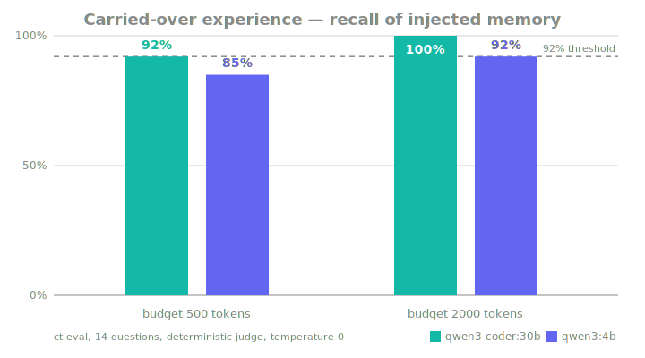

<table>
<tr>
<td width="150"></td>
<td>
<h1>cortical-transfer</h1>
<em>transport your AI identity, not just your prompts</em>
<br><br>
<sub>MemPack format &nbsp;·&nbsp; extract → inject → eval &nbsp;·&nbsp; local-first &nbsp;·&nbsp; Apache-2.0</sub>
</td>
</tr>
</table>

 

> ⚠️ **v0.2 — early development.** The MemPack format may change before 1.0;
> expect breaking changes between minor versions.


---

## The problem

Every time a better AI model comes out, you start over. The new model doesn't
know who you are, how you like to work, or what you were doing. Years of
accumulated context — gone.

**Cortical-Transfer fixes that.** It turns your chat history into a small,
portable memory file (a **MemPack**) that any model can read. Switch models;
your experience follows you.

## How it works, in one sentence

Every LLM understands one format natively — plain text in its context window —
so your memory is distilled into a self-describing text block whose header
tells the receiving model how to use it: **the file is the protocol**. No
special APIs, no embeddings, no fine-tuning.

The smallest proof is one markdown file:
[`examples/passport-skill.md`](examples/passport-skill.md) exports a live
session as a `PASSPORT.md` you paste into any other model, which resumes where
you left off. Cortical-Transfer is the same idea made rigorous: a versioned
schema, integrity checks, Git history, token budgeting, and a prompt-boundary
sanitizer.

## Does it actually work? Measured.

`ct eval` runs the whole pipeline end to end — extract memory, inject it into
a *receiving* model, quiz that model on 14 facts whose ground truth is in the
memory — and prints one number:

```
recall 14/14 (100%) @ budget 2000
```



| Receiving model | recall @ 500 tokens | recall @ 2000 tokens |
|---|---|---|
| qwen3-coder:30b (local) | 13/14 (92%) | **14/14 (100%)** |
| qwen3:4b (local) | 12/14 (85%) | 13/14 (92%) |

Reproducible with the files in [`examples/`](examples/) (temperature 0,
substring judge). This table doubles as the regression test: if a change to
extract/inject drops recall, it shows up here.

## Install

```bash
git clone https://github.com/HP-Ozy/Cortical-Transfer && cd Cortical-Transfer
uv sync          # or: pip install -e .
```

You need one LLM for the *extraction* step (it reads your history and distills
it). By default that's a local model via [Ollama](https://ollama.com). No LLM
is needed to inject — that's just text.

## Use it in 60 seconds

```bash
ct init                                      # 1. create a memory profile
ct extract examples/sample_history.jsonl     # 2. chat history -> memory
ct inject --budget 2000 > context.txt        # 3. portable context block
```

Paste `context.txt` as the first/system message into **any** model — GPT,
Claude, DeepSeek, a local model. That's the transfer.

Step 2 accepts your real data: the `conversations.json` from a ChatGPT or
Claude data export works as-is (`ct extract conversations.json`).

## All commands

| Command | What it does |
|---|---|
| `ct init` | create a Git-versioned memory profile |
| `ct extract <file>` | distill chat history and merge it into the existing memory (uses the LLM). Incremental: already-distilled conversations are skipped (`--force` redoes them) |
| `ct inspect` | pretty-print what the memory contains |
| `ct inject --budget N` | print the portable context block (~N tokens); `--query "topic"` ranks facts relevant to the topic first, so a tight budget spends its tokens on what the session is about |
| `ct eval <questions.json>` | measure recall on a receiving model (`--scoped` evals the query-scoped injection path) |
| `ct log` / `ct diff` / `ct checkout` | memory history: every change is a Git commit |
| `ct verify` | check SHA-256 integrity of the pack |
| `ct redact <node-id>` | permanently erase one fact, including from Git history |
| `ct export <file.mempack>` / `ct import` | move memory between machines/profiles |

## Configuration

Everything is configured with environment variables. Defaults work out of the
box with Ollama running locally.

| Variable | Default | Meaning |
|---|---|---|
| `CT_ADAPTER` | `ollama` | which LLM to use for extract/eval: `ollama`, `openai`, `anthropic` |
| `CT_MODEL` | `llama3.1:8b` | model name for the chosen adapter |
| `CT_BASE_URL` | adapter default | endpoint URL (any OpenAI-compatible server works) |
| `CT_API_KEY` | — | API key, only for cloud adapters |
| `CT_HOME` | `~/.cortical-transfer` | where memory profiles live |

Examples:

```bash
# local, best quality (any Ollama model you have)
CT_MODEL=qwen3-coder:30b ct extract history.jsonl

# any OpenAI-compatible endpoint (llama-server, DeepSeek, OpenAI, ...)
CT_ADAPTER=openai CT_BASE_URL=http://127.0.0.1:8080/v1 CT_MODEL=my-model ct extract history.jsonl

# Claude
CT_ADAPTER=anthropic CT_API_KEY=sk-... CT_MODEL=claude-sonnet-5 ct eval examples/eval_questions.json
```

## What's inside a MemPack

A folder of plain, human-readable files you can open and edit yourself:
**who you are** (`identity.json`), **what happened** (`episodes.json`),
**what's still open** (`threads.json`), **how you like to talk** (`style.md`),
plus a manifest with checksums. Full spec: [SPEC.md](SPEC.md).

Two rules keep it safe: memory is **data, never instructions** (an importer
must not execute anything found inside it), and old facts are **never silently
deleted** — a contradicted fact is marked superseded and kept. A fact can also
carry the dates it was **true in the real world** (`valid_from`/`valid_until`);
expired facts stay out of the context block.

## Development

```bash
uv sync --dev
uv run pytest && uv run ruff check . && uv run mypy
```

Design decisions: [docs/adr/](docs/adr/). License: Apache-2.0.
